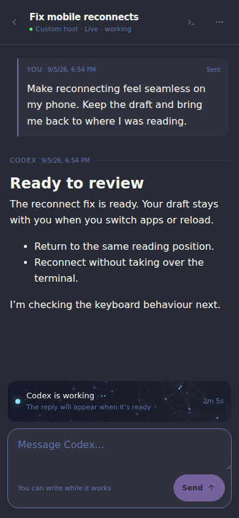

# Five-minute walkthrough

## 1. Install the Home bridge

You need Node.js 22.5 or newer, Herdr 0.8 or newer, and a running Herdr instance.

```bash
git clone https://github.com/gregmcausland/herdr-control.git
cd herdr-control
npm run control -- install
```

Open `http://127.0.0.1:4173`. The current machine appears as `Custom host` until
you give it a saved name. The installer starts a user service and stores Control
metadata at `~/.local/state/herdr-control/control.db`.

## 2. Name this machine and add others

Open the server button in the header. Add the current bridge URL with a useful
name. To supervise another machine, install Control there too, then add that
bridge's URL to the Home bridge.

For private remote access, keep each bridge on localhost and expose it through a
trusted layer such as Tailscale Serve:

```bash
tailscale serve 4173
```

Add the HTTPS address Tailscale prints. Control stores that URL and display name;
Tailscale authentication credentials remain with Tailscale.

## 3. Create the first Thread

Open a repository-backed workspace in Herdr. In Control, choose **New thread**
in the header or **All projects** below the active list, then select the Project.
Empty Projects remain in this picker even though they do not occupy a section
on home. Projects with open panes also have a plus button beside their heading.

Choose an available agent, then pick the project checkout, an existing worktree,
or **New worktree**. Existing worktrees show their branch and path. A new worktree
can use a new or existing branch name; leaving it blank lets Herdr generate one.
Use **Open another checkout** for a worktree known by its path. Agent and
permission settings remain under **Agent settings**.

Select **Start Thread** to open the conversation without a title or initial
prompt. Control waits for the agent to be ready, then opens the conversation
without acquiring its terminal. Write or dictate your first message there.
During launch, the form prevents duplicate submissions. Errors preserve your
checkout choices.

The agent continues under Herdr if the browser closes. Reopen its row to read
completed replies and write messages. Install [reply capture](reply-capture.md)
on its host first.

## 4. Read and interact

The conversation page shows captured prompts and completed replies. Prompts
can originate in Control or the agent's desktop session; supported capture hooks
observe both. New replies arrive after the response finishes, without opening
or taking control of the terminal.



- The working strip above the composer uses the same animation as the project
  list, with elapsed time when Herdr supplies a working start time. It stays
  visible while you read older messages and disappears when work ends or the
  host disconnects. Reduced-motion mode keeps it still.
- Type a message and choose **Send**, or use Ctrl/Cmd+Enter. Enter alone inserts
  a newline. Drafts are saved on this device across navigation and reload.
  **Sent** means Herdr accepted the prompt, not that the agent finished the task.
- Scroll up to read earlier replies. **Jump to latest** returns to the bottom;
  keyboard resizing preserves your position when reading history.
- The header's **Open terminal** button provides the full agent interface for
  interactive questions and tool output.
- Open **Thread actions** with the three-dot button for Archive, Stop agent,
  and resume actions when available. Archiving hides a Thread without stopping
  its process. Stopping requires confirmation.

Home keeps Projects in alphabetical order, then host order. Threads within each
Project use their original creation date, newest first. Status changes and
restored Runs do not move existing rows. **View archive** opens retained history,
newest archive date first; history does not expire automatically.

## Useful service commands

```bash
npm run control -- status
npm run control -- logs
npm run control -- update
npm run control -- restart
npm run control -- remove
```

Removal keeps the configuration and database. See the
[migration note](host-configuration-migration.md) before moving an older JSON
host list, and [compatibility](../COMPATIBILITY.md) before upgrading Herdr.
